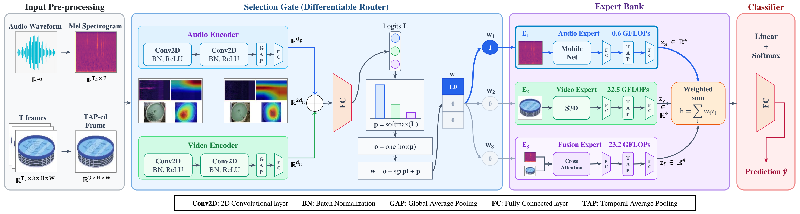

# DynaGate-AV: Dynamic Expert Routing for Efficient and Robust Audio-Visual Fish Feeding Assessment

[](https://www.python.org/)
[](https://pytorch.org/)

Official PyTorch implementation of **DynaGate-AV**, a dynamic expert-routing framework for fish feeding intensity assessment (FFIA). Instead of executing a fixed audio-visual multimodal fusion pipeline for every input sample, DynaGate-AV uses a lightweight CNN gate to select the most suitable expert for each synchronized audio-video clip. This enables efficient conditional inference and improves robustness when one modality is corrupted.


## Highlights

- **Dynamic conditional computation:** The framework routes each clip to an audio-only, video-only, or optional audio-video fusion expert.
- **Lightweight routing:** The CNN gate uses approximately 0.2M parameters and operates on log-Mel spectrograms and temporally pooled video frames.
- **Efficiency-aware learning:** A straight-through routing estimator is trained with a FLOPs-aware regularizer.
- **Adaptive regularization:** `IncreaseRegOnPlateau` progressively increases the cost penalty when validation accuracy plateaus.
- **Robust multimodal assessment:** The framework can shift toward the reliable modality under audio or visual corruption.

## Overview

Fish feeding intensity is classified into four levels: **None**, **Weak**, **Middle**, and **Strong**. At inference time, the routing gate makes a hard expert selection; only the selected expert is executed.

| Variant | Candidate experts | Intended use |
| --- | --- | --- |
| DynaGate-Light | Audio (MobileNetV2), Video (S3D) | Best accuracy-efficiency trade-off |
| DynaGate-Full | Audio, Video, Cross-Attention fusion | Maximum accuracy with optional fusion |

During training, all candidate experts are evaluated so that the routing policy can be optimized end-to-end with a straight-through estimator. During inference, only the selected branch runs.

<p align="center">
  
</p>

## Results

Results below are reported on the AV-FFIA test split from the accompanying paper draft. FLOPs are measured per sample.

| Method | Experts | Test accuracy (%) | GFLOPs | Expert usage (%) |
| --- | --- | ---: | ---: | --- |
| MobileNetV2 | Audio | 83.6 | 0.59 | Audio: 100.0 |
| S3D | Video | 82.7 | 22.51 | Video: 100.0 |
| Self-Attention | Static fusion | 89.2 | 23.11 | Fusion: 100.0 |
| MBT | Static fusion | 74.0 | 23.13 | Fusion: 100.0 |
| Cross-Attention | Static fusion | 92.4 | 23.23 | Fusion: 100.0 |
| **DynaGate-Light** | Audio + Video | **96.4** | **5.29** | Audio: 79.1, Video: 20.9 |
| **DynaGate-Full** | Audio + Video + Cross-Attention | **96.5** | **5.64** | Audio: 77.6, Video: 20.3, Fusion: 2.1 |

Under severe corruption, DynaGate-Light achieves 85.5% accuracy with audio noise at -10 dB SNR (+6.1 points over Cross-Attention) and 82.6% with Gaussian video noise at sigma = 0.2 (+4.8 points).

## Repository structure

```text
.
├── config.py                         # Experiment and data configuration
├── data/
│   └── dataset.py                    # AV-FFIA loading and split construction
├── models/
│   ├── dynamic_ffia.py               # Training-time dynamic-routing model
│   ├── inference_model.py             # Conditional-execution inference model
│   ├── backbones.py                   # Audio and video encoders
│   ├── fusions.py                     # Fusion experts
│   └── gate.py                        # CNN, MLP, and Transformer gates
├── scripts/
│   ├── train.py                       # Standard training
│   ├── train_with_reg_scheduler.py    # Adaptive-regularization training
│   └── inference.py                   # One-switch inference and analysis
├── utils/
│   ├── trainer.py                     # Training and evaluation loops
│   └── scheduler.py                   # IncreaseRegOnPlateau
└── website/                           # Project page assets
```

## Installation

The code is implemented with PyTorch. We recommend a CUDA-enabled PyTorch installation appropriate for your system.

```bash
git clone https://github.com/Buu2004/moe_ffia.git
cd moe_ffia

python -m venv .venv
# Linux/macOS
source .venv/bin/activate
# Windows PowerShell: .venv\Scripts\Activate.ps1

pip install -r requirements.txt
```

## Dataset

Experiments use the [AV-FFIA dataset](https://zenodo.org/records/11059975), which contains 19,963 synchronized two-second audio-video clips. The implementation reproduces the paper split: 14,363 training clips, 2,800 validation clips, and 2,800 test clips (700 per class).

Download and extract the dataset, then set `CONFIG['data_root']` in [`config.py`](config.py) to its root directory. The loader discovers video directories beginning with `video_` and finds their aligned audio files under `audio_dataset/audio_dataset/`.

```text
<data_root>/
├── video_*/ ... /{strong,medium,weak,none}/*.mp4
└── audio_dataset/
    └── audio_dataset/ ... /*.wav
```


## Training

Run commands from the repository root. 

### DynaGate-Light 

```bash
python -m scripts.train --fusion_type none --n_runs 2 --batch_size 32
```

### DynaGate-Full

```bash
python -m scripts.train --fusion_type cross_attn --n_runs 2 --batch_size 32
```

Available `--fusion_type` values are `none`, `cross_attn`, `self_attn`, and `mbt`. `none` selects the two-expert DynaGate-Light model; all other values add a third fusion expert.

The best validation-loss checkpoint from each run is written to the repository root as:

```text
best_model_run_<run>_<fusion_type>.pth
```

### Training with adaptive FLOPs regularization

To use the proposed `IncreaseRegOnPlateau` scheduler, run:

```bash
python -m scripts.train_with_reg_scheduler \
  --fusion_type none \
  --n_runs 2 \
  --factor 1.5 \
  --patience 3 \
  --min_reg 0.0001 \
  --max_reg 0.003
```

The scheduler increases `CONFIG['reg']` after validation accuracy does not improve in the configured patience period.

## Inference

Provide a trained checkpoint and match its fusion setting:

```bash
# DynaGate-Light
python -m scripts.inference \
  --fusion_type none \
  --model_path best_model_run_1_2branch.pth \
  --device cuda

# DynaGate-Full with Cross-Attention
python -m scripts.inference \
  --fusion_type cross_attn \
  --model_path best_model_run_1_cross_attn.pth \
  --device cuda
```

Inference reports accuracy and throughput. It also saves confusion matrices and overall expert usage figures in the current working directory.

## Citation

If you use this code, please cite the paper once publication details are available:

```bibtex
@article{nguyen2026dynagateffia,
  title   = {DynaGate-AV: Dynamic Expert Routing for Efficient and Robust Audio-Visual Fish Feeding Assessment},
  author  = {Minh D. Nguyen, Ba Hung Ngo, Cuong D. Do, and Van-Dinh Nguyen},
  journal = {arXiv preprint},
  year    = {2026}
}
```
